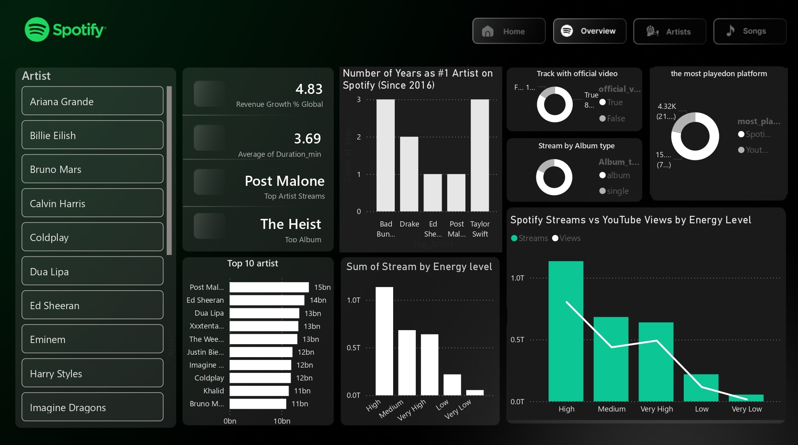
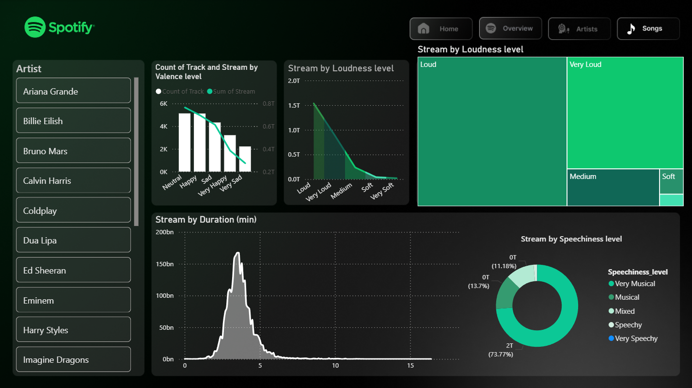

# Spotify Data Visualization Project

This project analyzes Spotify data to explore trends, artist performance, and audio features of tracks. The goal is to transform complex datasets into clear, actionable insights using Python and Power BI.

## Project Objectives
- Analyze listening behaviors on Spotify
- Explore top artists and tracks
- Correlate streams with audio features (energy, danceability, loudness, valence, etc.)
- Build interactive dashboards for visualization

## Project Structure
- `cleaned/` – cleaned datasets for analysis
- `scripts/` – Python scripts for data processing and visualization
- `spotify_dataset.csv` – raw dataset
- `Dashboars/` – screenshots of dashboards

## Technologies & Skills
- Python, Pandas
- Data Visualization
- Power BI

## Dashboards
 
Analyzes Artist rankings, revenue growth, and the correlation between Energy levels and stream counts across Spotify and YouTube.

 
Visualizes long-term revenue growth (2016–2025) and how Danceability scores drive total stream and view volumes.

Analyzes technical track features by correlating streams with Valence, Loudness, and Speechiness, while identifying the most successful song durations.

## Team
- Ali Kerroum
- Yassir Tahin
- Yassine Eljabali
- Abderrahmane Jennati

